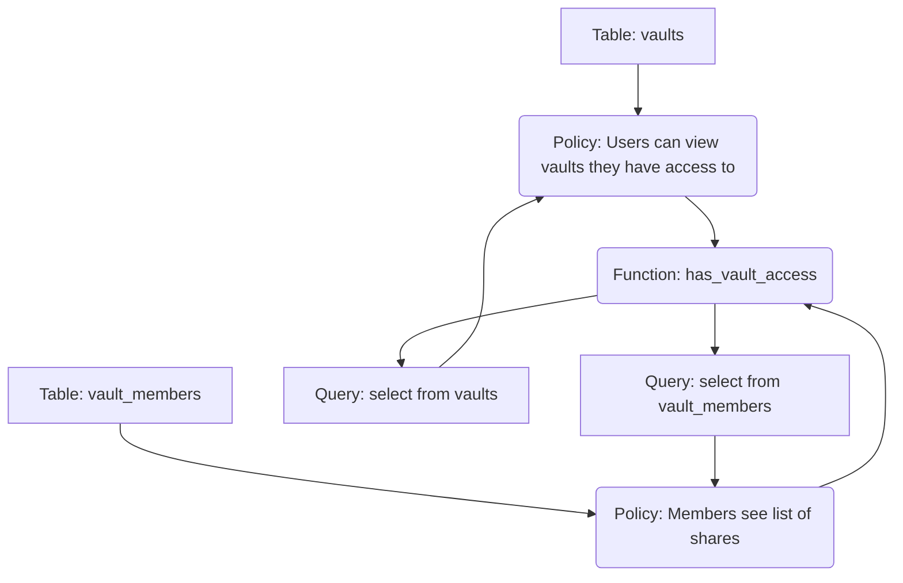

# PDF-Crab — Database State Report

This document reports the verified authorization and schema state of the live database, mapped directly from API tests and catalog definitions.

---

## 1. Active Tables, Columns, and RLS Status
All 10 core tables are successfully present in the database, with Row Level Security (RLS) active on each table:

| Relation Name | RLS Status | Verified Columns |
| :--- | :--- | :--- |
| `profiles` | ENABLED | `id`, `created_at`, `updated_at`, `email`, `avatar_url`, `full_name`, `telegram_chat_id`, `telegram_username`, `telegram_link_code`, `tg_default_vault_id`, `tg_auto_compile`, `tg_notifications`, `tg_ocr_lang` |
| `vaults` | ENABLED | `id`, `created_at`, `updated_at`, `name`, `owner_id` |
| `vault_members`| ENABLED | `id`, `created_at`, `updated_at`, `vault_id`, `profile_id` |
| `documents` | ENABLED | `id`, `created_at`, `updated_at`, `vault_id`, `name`, `storage_path`, `size`, `mime_type`, `page_count`, `checksum`, `ocr_text_hash`, `owner_id` |
| `master_notes` | ENABLED | `id`, `created_at`, `updated_at`, `vault_id`, `title`, `coverage`, `generated`, `version`, `ai_model`, `ocr_provider`, `source_document_hashes`, `active` |
| `note_sections`| ENABLED | `id`, `created_at`, `updated_at`, `master_note_id`, `heading`, `body`, `display_order`, `source_document_id`, `page_numbers`, `ocr_source`, `compile_version` |
| `ocr_jobs` | ENABLED | `id`, `created_at`, `updated_at`, `document_id`, `status`, `raw_text`, `processed_text`, `page_count`, `confidence_score`, `error_message`, `retry_count` |
| `compile_jobs` | ENABLED | `id`, `created_at`, `updated_at`, `master_note_id`, `status`, `phase`, `progress`, `error_message`, `started_at`, `completed_at`, `duration` |
| `compilation_reports`| ENABLED | `id`, `created_at`, `master_note_id`, `ai_provider`, `ai_model`, `ocr_provider`, `compile_duration`, `input_tokens`, `output_tokens`, `duplicates_removed`, `pages_processed`, `warnings`, `errors` |
| `exports` | ENABLED | `id`, `created_at`, `updated_at`, `master_note_id`, `format`, `storage_path` |

---

## 2. Dependency Graph & Recursion Analysis

### Recursion Chain
1. Client issues `SELECT` on `vaults` (or `INSERT ... RETURNING` which runs a returning select).
2. The database evaluates the policy on `vaults`, which invokes `public.has_vault_access(id, auth.uid())`.
3. Inside `has_vault_access`, it queries `select 1 from public.vaults where id = p_vault_id ...`.
4. If the function is not executed as `security definer` or runs with active RLS under the current session context, this nested query triggers RLS on `vaults` again.
5. This leads to an **infinite recursion** state.

### Obsolete / Conflicting Policies
- **`Profiles`**: The policy `Public profiles are viewable by everyone` allows anonymous users to view emails. It should be dropped in favor of an authenticated restriction.
- **`Vaults`**: Duplicate select policies (`Users can view vaults they have access to`, `Users can view vaults they own or are members of`) exist due to prior incremental patches.
- **`Compilation Reports`**: Policies referencing `has_vault_access` must be fully dropped and rebuilt to allow dropping the original signature of `has_vault_access(uuid, uuid)`.
